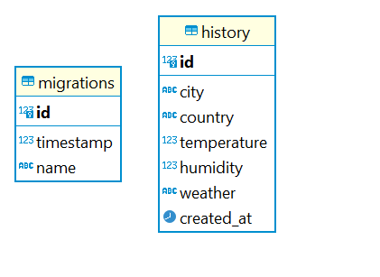

# tech4-api

<h4 align="center">
    :computer: Api para registro e consulta de temperatura de cidade
</h4>

<div align="center">
    
</div>


<p align="center">
    <a href="#-projeto">Projeto</a>&nbsp;&nbsp;&nbsp;|&nbsp;&nbsp;&nbsp;
    <a href="#rocket-tecnologias">Tecnologias</a>&nbsp;&nbsp;&nbsp;|&nbsp;&nbsp;&nbsp;
    <a href="#user-content-clipboard-instruções">Instruções</a>&nbsp;&nbsp;&nbsp;|&nbsp;&nbsp;&nbsp;
    <a href="#%EF%B8%8F-comandos-básicos-para-as-migrations">Migrations</a>&nbsp;&nbsp;&nbsp;|&nbsp;&nbsp;&nbsp;
    <a href="#-gerar-o-build">Build</a>&nbsp;&nbsp;&nbsp;|&nbsp;&nbsp;&nbsp;
    <a href="#%EF%B8%8F-collection-das-requisições---insomnia">Requisições</a>&nbsp;&nbsp;&nbsp;|&nbsp;&nbsp;&nbsp;
    <a href="#-ajustes-e-melhorias">Melhorias</a>
</p>
 
----
 ## 💻 Projeto

API em ExpressJS. Aplicação backend para cadastramento de temperatura de cidades, e consulta das cidades mais pesquisadas

----
## :rocket: Tecnologias

- [Typescript](https://www.typescriptlang.org/)
- [ExpressJS](https://expressjs.com/pt-br/)
- [Typeorm](https://typeorm.io/)
- [Docker](https://www.docker.com/)
- [PostgreSQL](https://www.postgresql.org/)
- [Yup](https://www.npmjs.com/package/yup)
- [Nodemon](https://www.npmjs.com/package/nodemon)
- [ts-node](https://www.npmjs.com/package/ts-node)

----
## :clipboard: Instruções

### VARIÁVEIS DE AMBIENTE

- Criar na raiz da pasta do projeto um arquivo `.env` e preencher as informações conforme se encontra no arquivo `.env.example`.

### DOCKER

- Após preenchida as variáveis de ambiente, subir o container do docker pelo terminal com o comando:

```bash
docker-compose up
```

### DEPENDÊNCIAS

- No terminal executar o comando para instalar as dependências:

```bash
yarn
```

### MIGRATIONS

- No terminal executar as migrations para criar as tabelas do banco de dados, com o comando:

```bash
yarn typeorm migration:run
```

### START

- Finalizado! Basta agora executar a aplicação backend com o seguinte comando:

```bash
yarn dev
```

- A Api estará rodando na porta conforme definido no arquivo .env em PORT, por padrão utilize
  a porta 4000. `http://localhost:4000`

----
## ⚙️ Comandos básicos para as migrations

- Criar uma migration

```bash
yarn typeorm migration:create -n CreateExample
```

- Rodar as migrations

```bash
yarn typeorm migration:run
```

- Desfazer alterações da migration

```bash
yarn typeorm migration:revert
```

----
## 📬 Gerar o build 

```bash
yarn build
```

----
 ## ✈️ Collection das requisições - insomnia
 
 - As collections das requisições backend `Insomnia_2021-05-23.json` se econtra dentro da pasta `assets` deste projeto.

----
## 📌 Ajustes e melhorias

Até o momento não há nenhuma nova feature para a api

